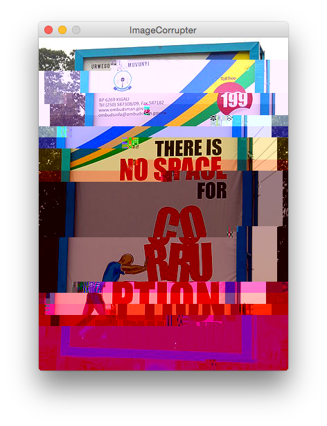
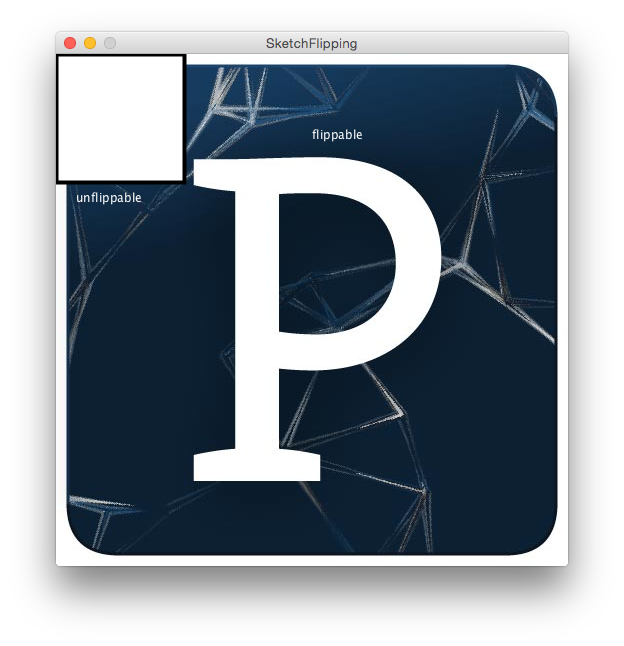
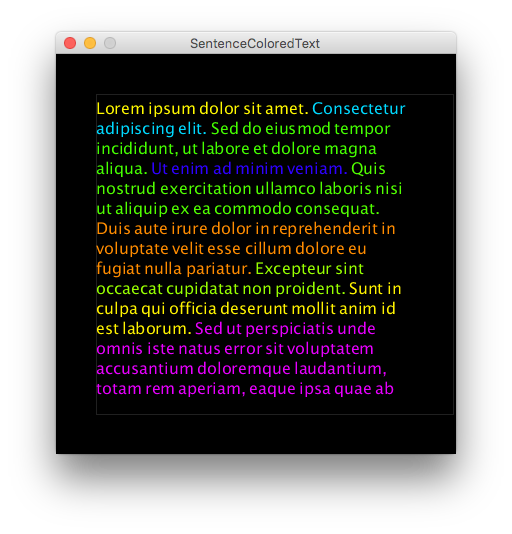

# Examples

_Processing sketches for demonstrating basic aspects of the language and solutions to common problems._

| Sketches    |     |
| ----------- | --- |
| ** data **                                   | |
| [DistributionGraphs](data/DistributionGraphs)     |  |
| [NumericTypes](data/NumericTypes)                 | |
| [StringSaveAndLoad](data/StringSaveAndLoad)       | |
| ** geometry **                               | |
| [PointSpheres](geometry/PointSpheres)                 |  |
| [QuadraticPoints](geometry/QuadraticPoints)           | |
| [RandomWalkWinding](geometry/RandomWalkWinding)       | |
| [RelativeSquare](geometry/RelativeSquare)             |  |
| [SphereLighting](geometry/SphereLighting)             |  |
| ** input **                                  | |
| [ConsoleTyping](input/ConsoleTyping)               | |
| [MouseCursors](input/MouseCursors)                 | |
| ** pixels **                                 | |
| [ColorTransition](pixels/ColorTransition)           | |
| [FullScreenResolution](pixels/FullScreenResolution) | |
| [FullScreenResolutionCropped](pixels/FullScreenResolutionCropped) | |
| [ImageCorrupter](pixels/ImageCorrupter)             |  |
| [SketchFlipping](pixels/SketchFlipping)             |  |
| ** text ** | |
| [SentenceColoredText](text/SentenceColoredText)             |  |
| ** time ** | |
| [DrawLooping](time/DrawLooping)                   | |
