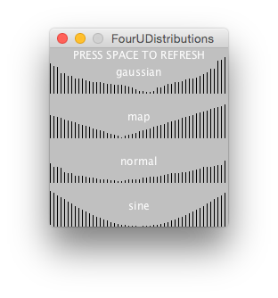
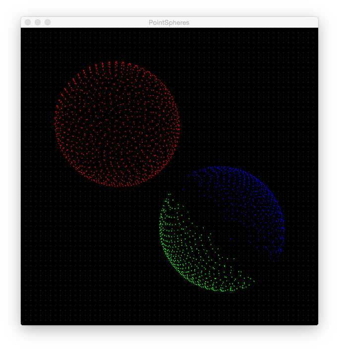
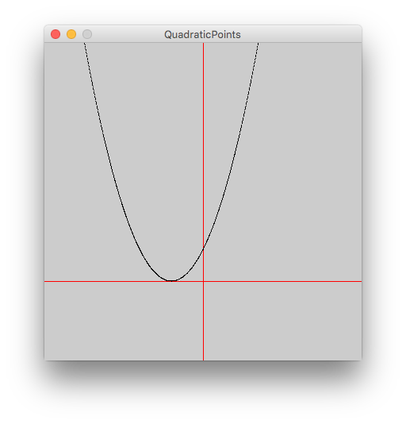
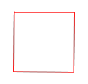
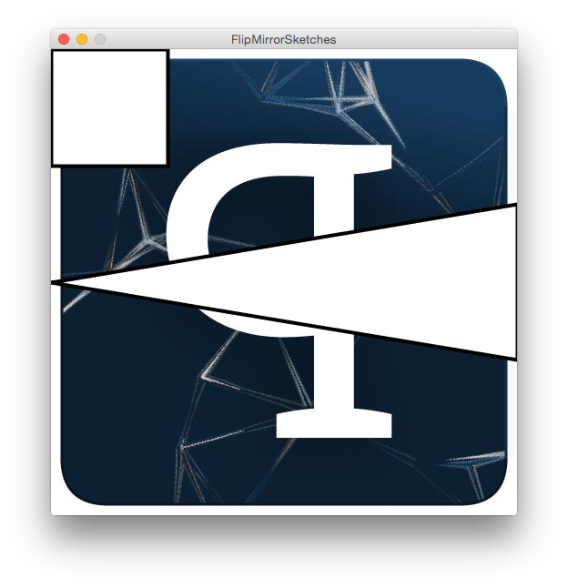

# Examples

_Processing sketches for demonstrating basic aspects of the language and solutions to common problems._

| Sketches    |     |
| ----------- | --- |
| ** data **                                   | |
| [DistributionGraphs](DistributionGraphs)     |  |
| [NumericTypes](NumericTypes)                 | |
| [StringSaveAndLoad](StringSaveAndLoad)       | |
| ** geometry **                               | |
| [PointSpheres](PointSpheres)                 |  |
| [QuadraticPoints](QuadraticPoints)           | |
| [RelativeSquare](RelativeSquare)             |  |
| ** input **                                  | |
| [ConsoleTyping](ConsoleTyping)	             | |
| [MouseCursors](MouseCursors)                 | |
| ** pixels **                                 | |
| [ColorTransition](ColorTransition)           | |
| [FullScreenResolution](FullScreenResolution) | |
| [FullScreenResolutionCropped](FullScreenResolutionCropped) | |
| [ImageCorrupter](ImageCorrupter)             |  |
| [SketchFlipping](SketchFlipping)             |  |
| ** text ** | |
| [SentenceColoredText](SentenceColoredText)             |  |
| ** time ** | |
| [DrawLooping](DrawLooping)                   | |
